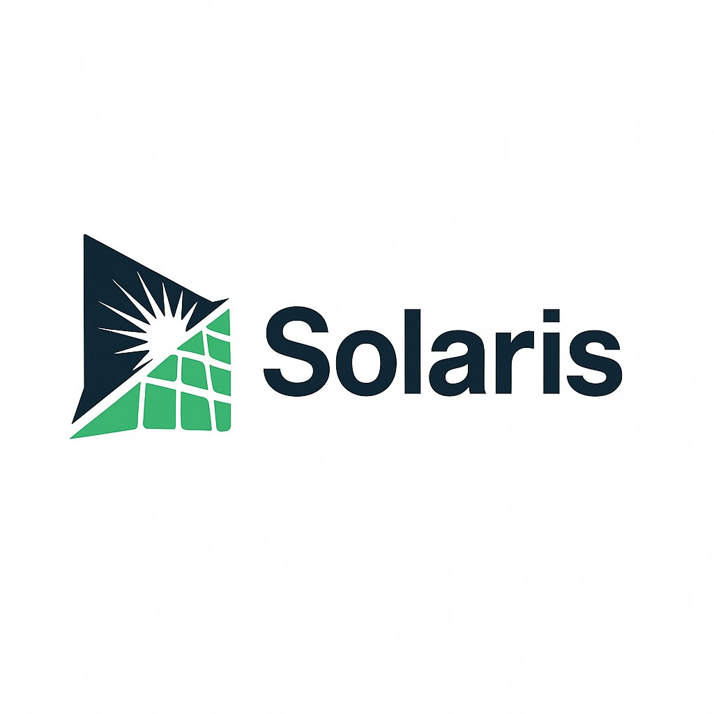

<h1 align="center"> Solaris – Application de Gestion des Énergies Renouvelables</h1>

  

## 🌱 À propos

### **Solaris** est une application de bureau développée en Java qui centralise la gestion des **produits liés aux énergies renouvelables**, des événements, des utilisateurs, des blogs ainsi que du suivi des déchets. L'application vise à encourager une consommation responsable et une gestion intelligente de l'énergie.

---

## 🧩 Modules Principaux

### L’application est divisée en 5 modules :

1. **🧍‍♂️ Gestion des utilisateurs (`feature\user`)**
    - **Responsable : Wael Chenoufi**
    - Création, connexion, rôles et autorisations des utilisateurs.

2. **♻️ Gestion des déchets (`feature\dechets`)**
    - **Responsable : Malek Hamdi**
    - Suivi et gestion des déchets pour renforcer l’impact écologique.

3. **🗓️ Gestion des événements (`feature\events`)**
    - **Responsable : Yosr Naffeti**
    - Réservation, planification et gestion des ateliers et événements.

4. **📰 Module Blog (`feature\blogs`)**
    - **Responsable : Sarra Abdallah**
    - Publication d'articles informatifs, d’actualités et de conseils.

5. **🛍️ Gestion des produits (`feature\produits`)**
    - **Responsable : Nasri Ayari**
    - Gestion du catalogue des produits verts : ajout, modification, suppression.

---

## 🛠️ Technologies Utilisées

| Technologie           | Description                            |
|------------------------|-----------------------------------------|
| **Java 17**           | Langage principal                       |
| **JavaFX**            | Interface graphique                     |
| **Scene Builder**     | Création d’interfaces en glisser-déposer |
| **IntelliJ IDEA**     | Environnement de développement          |
| **WAMP + phpMyAdmin** | Base de données MySQL locale            |
| **Git & GitHub**      | Suivi des versions, collaboration       |

